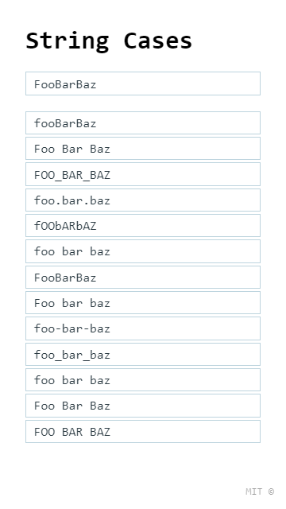

# string-cases

> Convert variable name to various cases

Demo: [vovanr.github.io/string-cases][demo]

## Usage

`https://vovanr.github.io/string-cases/?q=<string_value>`

Example: [vovanr.github.io/string-cases/?q=FooBarBaz](https://vovanr.github.io/string-cases/?q=FooBarBaz)

## Techs

- [Parcel](https://parceljs.org/)
- [Preact](https://preactjs.com/)

## License
MIT © [Vladimir Rodkin](https://github.com/VovanR)

[demo]: https://vovanr.github.io/string-cases
